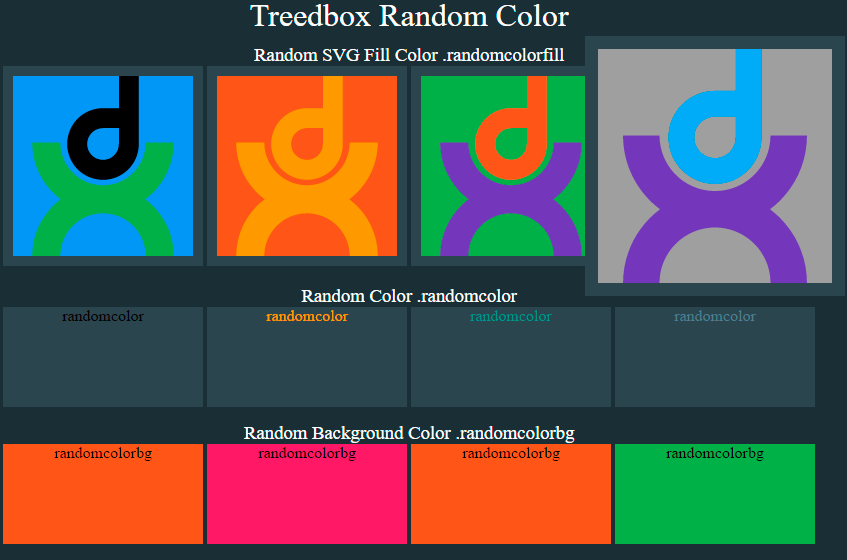

# Treedbox Random Color 2.0.0
> Random color, Random Background Color, Random SVG Fill Color, Random SVG Stroke Color.

By: [Jonimar Marques Policarpo](https://www.linkedin.com/in/treedbox/ 'LinkEdin') at [Treedbox](http://treedbox.com)



## Online Test
[https://treedbox.github.io/treedbox-random-color](https://treedbox.github.io/treedbox-random-color 'Treedbox Random Color')


## What's News?
The [Version 1.0.0](versions/1.0.0) extract the colors from .CSS files. This version (2.0.0) does not depend of any css file. It applyes directly from palettes of color like this:
```
const material = [
  '#009688','#00BCD4','#03A9F4','#2196F3','#3F51B5',
  '#4CAF50','#607D8B','#673AB7','#795548','#8BC34A',
  '#9C27B0','#9E9E9E','#CDDC39','#E91E63','#F44336',
  '#FF5722','#FF9800','#FFC107','#FFEB3B'
];
```
Now the random color change is even more fast (compared with the first version).

### Custom Pallete
Now you can create your own palette and easily customize your colors:
```
//custom palette
const vimeoInteresting = [
  '#667daf','#fd585f','#ff8a3d','#a61e2a','#4dbaff',
  '#fbca54','#abd450','#66cc9a'
];
//using the custom palette
treedboxRandomColor(randomcolorfill,['click'],vimeoInteresting);
```

## How to use
1. Include style class in the element that you want to be affected:
`randomcolorfill` to affect SVG Fill:
```
<svg viewBox="0 0 12065 12065">
  <rect class="randomcolorfill" width="12065" height="12065"/>
  <path class="randomcolorfill" d="M8431..."/>
  <path class="randomcolorfill" d="M8868..."/>
</svg>
```

`randomcolorstroke` to affect SVG Stroke:
```
<svg viewBox="0 0 481 481">
  <path class="randomcolorstroke" d="M28 260l27..."/>
</svg>
```

`randomcolor` to affect color text/font:
```
<div class="box boxcolor randomcolor">randomcolor</div>
```

`randomcolorbg` to affect background Color:
```
<div class="box boxbg randomcolorbg">randomcolorbg</div>
```

2. Include `treedbox-random-color.js` before your `script.js`:
```
</body>
<!-- Treedbox Random Color -->
<script src="js/treedbox-random-color.js"></script>
<!-- File to call treedboxRandomColor() -->
<script src="js/script.js"></script>
</html>
```
3. On `script.js` call the function `treedboxRandomColor()` passign the **element's group** and the **event** to listen:
```
treedboxRandomColor(randomcolorfill,['mouseover']);
```

### Elemet's group
An array with all the elements with the same classes:
* randomcolorfill
* randomcolorstroke
* randomcolor
* randomcolorbg

### Event
use any event that you want:
```
click,mouseover,mouseout,mousemove
touchstart,touchend,touchcancel,touchmove
wheel,focus,focusout,blur
```
**WARNING**: mousemove will result in a bunch of blinks

### Multiple Events
You can add multiple event listeners for elements group:
```
treedboxRandomColor(randomcolorstroke,['mouseover','mouseout','touchstart']);
```
### Multiple Groups
You can add multiple elements group for a single event:
```
treedboxRandomColor([...randomcolorfill,...randomcolorstroke],['mouseover']);
```
### Multiple Groups and Multiple Events
You can add multiple elements group for multiple event, all together:
```
treedboxRandomColor([...randomcolorfill,...randomcolorstroke,...randomcolor,...randomcolorbg],['wheel','click','focus']);
```

## Tested
Google Chrome **62**

Firefox **56**

Also work without a server.

## Meta
Author: [Jonimar Marques Policarpo](https://www.linkedin.com/in/treedbox/ 'LinkEdin') [Front-End Web Developer]

LinkEdin:  [Jonimar Marques Policarpo | Treedbox](https://www.linkedin.com/in/treedbox/ 'LinkEdin')

Twitter:  [@treedbox](http://twitter.com/treedbox)

E-mail:  [treedbox@gmail.com](mailto:treedbox@gmail.com)

WebSite:  [treedbox.com](http://treedbox.com)

## License
[MIT](LICENSE.md) © [TreedBox](https://github.com/treedbox)

### Offical Repository
Version 2.0.0

[https://github.com/treedbox/treedbox-random-color](https://github.com/treedbox/treedbox-random-color)

[Version 1.0.0](versions/1.0.0)
