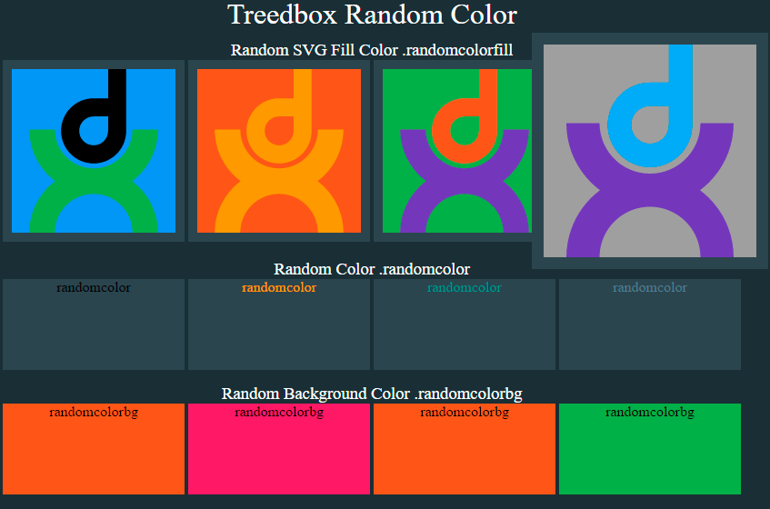

# Treedbox Random Color 1.0.0
> Random color, Random Background Color, Random SVG Fill Color.



## Online Test
[https://treedbox.github.io/treedbox-random-color](https://treedbox.github.io/treedbox-random-color/versions/1.0.0 'Treedbox Random Color 1.0.0')

## How to use
**1** - Include any or all css color files in your html head
```
<head>
  ...
  <!-- Random Color -->
  <link rel="stylesheet" href="css/colors.css">
  <!-- Random Background Color -->
  <link rel="stylesheet" href="css/colorsbg.css">
  <!-- Random Fill Color -->
  <link rel="stylesheet" href="css/colorsfill.css">
  <!-- Random Stroke Color -->
  <link rel="stylesheet" href="css/colorsstroke.css">
</head>
```
**2** - Include style class in the element that you want to be affected:

`randomcolorfill` to affect SVG Fill (using `colorsfill.css`):
```
<svg viewBox="0 0 12065 12065">
  <rect class="randomcolorfill" width="12065" height="12065"/>
  <path class="randomcolorfill" d="M8431..."/>
  <path class="randomcolorfill" d="M8868..."/>
</svg>
```

`randomcolorstroke` to affect SVG Stroke (using `colorsstroke.css`):
```
<svg viewBox="0 0 481 481">
  <path class="randomcolorstroke" d="M28 260l27..."/>
</svg>
```

`randomcolor` to affect color text/font (using `colors.css`):
```
<div class="box boxcolor randomcolor">randomcolor</div>
```

`randomcolorbg` to affect background Color  (using `colorsbg.css`):
```
<div class="box boxbg randomcolorbg">randomcolorbg</div>
```

**3** - Include `treedbox-random-color.js` before your `script.js`:
```
</body>
<!-- Treedbox Random Color -->
<script src="js/treedbox-random-color.js"></script>
<!-- File to call treedboxRandomColor() -->
<script src="js/script.js"></script>
</html>
```
**4** - On `script.js` call the function `treedboxRandomColor()`:
```
...
//call Treedbox Random Color
treedboxRandomColor();
```
## How it Works
**1** - When you call `treedboxRandomColor()`, it get all tags `links` from your HTML, verify if the `stylesheet` links refer to a treedbox Random Color file (`colors.css`, `colorsbg.css`, `colorsfill`);

**2** - Start to extract classes of each valid/founded color CSS file;

**3** - Add event listener to each tagged HTML element:

`focusin`, `click`, `blur`: Apply a Random color;

`mouseleave`, `focusout`, `blur`: After 5 seconds remove applied color.

*You can disable any listener that you want, for example, if you disable:
`mouseleave`, `focusout` and `blur`, color will not be removed :)*
```
//add mouseleave/not hover listener on each element
// el.addEventListener('mouseleave', removeRandomColor);
//add focusout/not focus listener on each element
// el.addEventListener('focusout', removeRandomColor);
// el.addEventListener('blur', removeRandomColor);
```

## Tested
Google Chrome **55**
Google Chrome **56**

Firefox **50.1.0**
Firefox **51.0.1**

## Meta
Front-End Developer: [Jonimar Marques Policarpo](http://linkedin.com/in/treedbox 'LinkEdin')

Twitter: [@treedbox](http://twitter.com/treedbox)

E-mail: [treedbox@gmail.com](mailto:treedbox@gmail.com)

Site: [treedbox.com](http://treedbox.com)

## License
[MIT](LICENSE.md) © [TreedBox](https://github.com/treedbox)

[https://github.com/treedbox/treedbox-random-color](https://github.com/treedbox/treedbox-random-color)
